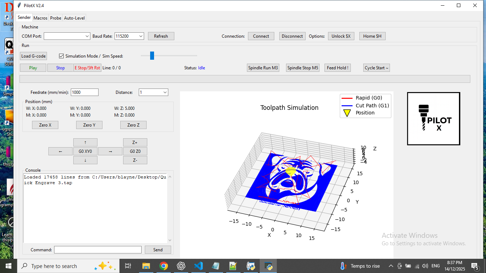
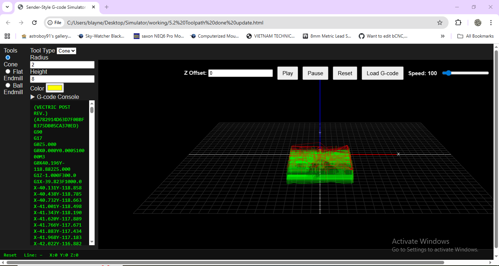

This is an experimental Gcode sender written mostly with Chat GPT 5.1
IMPORTANT DISCLAIMER: This is my personal project and has only been tested by me on my OX CNC Running GRBL Mega 5X, GRBL 1.2H.
 If you choose to run it, you do so entirely at your own risk. 
I am not responsible for any damage, malfunction, or personal injury that may result from the use or misuse of PilotX.
 Use it with caution and at your own discretion.

PilotX is essentially a full-featured CNC sender with built-in macro support, 
threaded auto-leveling, 3D visualization, and height-map application for G-code, 
all integrated into a Tkinter GUI.
 It handles real CNC control, simulation, logging, and data export, making it very versatile for desktop CNC users.

Included is a simulator that runs in your browser, only an internet connection is needed

Make Sure GRBL Status Mask is $10=1 or whatever reports your <Mpos ... ... ... >

1. G-code Management

Load G-code files (*.gcode, *.nc, *.tap)

Remove empty lines and comments on load

Display total lines and progress in GUI

Send G-code line-by-line to GRBL, with pipeline buffering for GRBL 1.2h

Pause, stop, resume G-code streaming

Simulation mode for testing without a machine

Toolpath visualization in 3D (blue lines for paths, yellow cone for current position)

2. Macro Management

Add, run, and delete macros

Macros consist of a name and G-code block

Macros can be run line-by-line, with automatic GRBL ok wait

Logs macro execution in the console

3. Probing and Auto-Leveling

Single-axis Z probing from UI entries

X and Y centering probes

Auto-leveling grid probing:

User-defined start/end points and steps for X/Y axes

Snake pattern probing for efficiency

Handles alarms, retries, and stop events

Simulation mode for testing bed shape

Partial and full 3D visualization of probe map

CSV export of the probe height map

Apply height map corrections to loaded G-code (bilinear interpolation)

Save corrected G-code to a file

4. CNC Control

Jogging: move X, Y, Z in both directions with adjustable feed and distance

Go to origin: G0 X0 Y0 and G0 Z0 functions

Zero axis functions (X, Y, Z) with optional machine coordinate update (G10 L20 P1 X0)

Unlock machine ($X command)

Serial connection management:

List available serial ports

Connect/disconnect at selectable baud rate

Reset DTR/RTS signals

5. DRO (Digital Read Out)

Displays WPos (work coordinates) and MPos (machine coordinates) for X, Y, Z

Thread-safe updates from GRBL status lines

Updates in real-time during jogging, G-code sending, and probing

6. Visualization

3D toolpath simulation (lines and moving cone)

Auto-level bed surface plotting:

Partial (during probing) and full surface (after probing)

Handles NaNs and snake-pattern correction

Uses matplotlib with Tkinter canvas

7. Logging / Console

Thread-safe console output for:

Commands sent to GRBL

Macro execution

Auto-leveling progress

GRBL responses

Filters out noise lines like ok, ?, MPos/WPos unless needed

8. Safety & Robustness

Threaded operations for:

Serial reading

Auto-leveling

Position polling

Instant stop capability for G-code sending or probing

Graceful handling of GRBL alarms, errors, soft resets

Retry mechanism for probing

9. Extra Features

Simulation mode for safe testing without hardware

Progress bar and line counters for G-code streaming

Auto-level height reference handling

Neighbor-based NaN filling for smoother bed surface mapping

